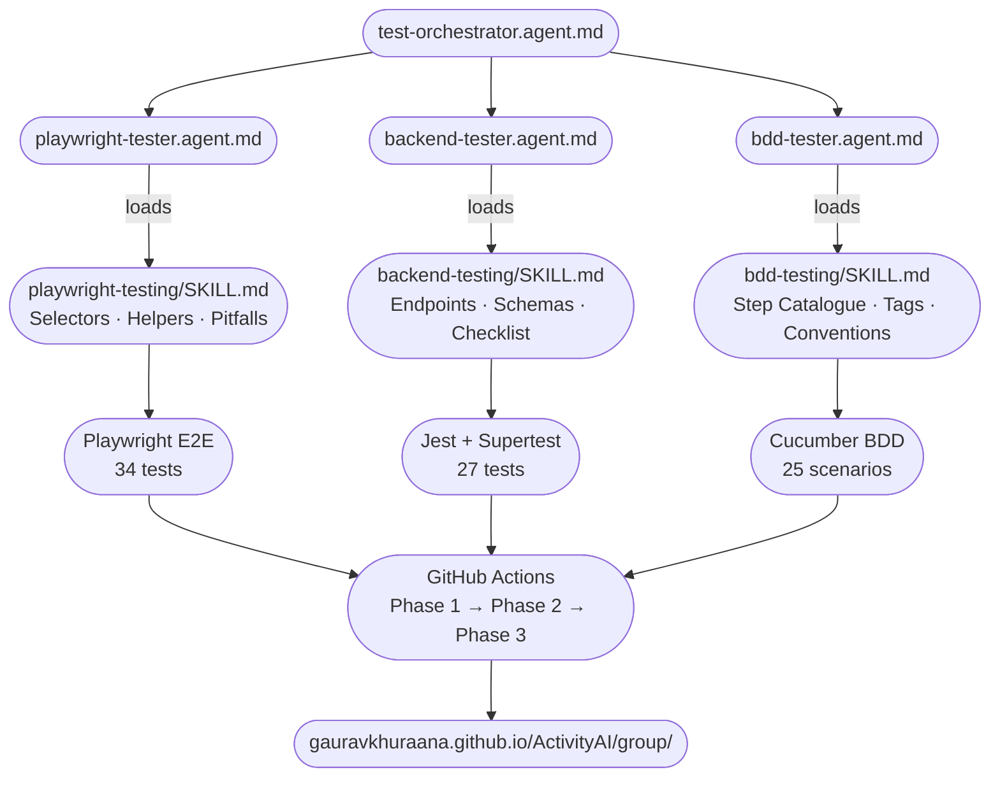

# GROUP_ACTIVITY — Testing Agents Orchestration

Comprehensive test suite for the **Employee Manager** application using three coordinated testing agents: Playwright E2E, Jest/Supertest backend API, and Cucumber BDD.

---

## Agent Orchestration Architecture



---

## Folder Structure

```
GROUP_ACTIVITY/
├── agents/
│   ├── test-orchestrator.agent.md   # Orchestrates all three agents
│   ├── playwright-tester.agent.md   # E2E browser tests
│   ├── backend-tester.agent.md      # API integration tests
│   ├── bdd-tester.agent.md          # BDD/Gherkin scenarios
│   └── skills/
│       ├── playwright-testing/SKILL.md
│       ├── backend-testing/SKILL.md
│       └── bdd-testing/SKILL.md
└── tests/
    ├── e2e/
    │   └── employee-app.spec.js     # 34 Playwright tests
    ├── backend/
    │   └── api.test.js              # 27 Jest + Supertest tests
    └── bdd/
        ├── cucumber.js              # Cucumber config
        ├── features/
        │   ├── auth.feature         # 9 auth scenarios
        │   ├── employee.feature     # 7 CRUD scenarios
        │   ├── search.feature       # 5 search scenarios
        │   └── theme-navigation.feature  # 4 navigation scenarios
        └── steps/
            └── steps.js
```

---

## Prerequisites

The application must be running before executing any tests.

```bash
# Terminal 1 — Backend (port 4000)
cd backend
npm install
node server.js

# Terminal 2 — Frontend (port 5173)
cd frontend
npm install
npm run dev
```

---

## Running Tests

```bash
cd GROUP_ACTIVITY
npm install
```

| Command | Suite | Tests |
|---------|-------|-------|
| `npm run test:backend` | Jest + Supertest | 27 |
| `npm run test:bdd` | Cucumber BDD | ~25 |
| `npm run test:e2e` | Playwright E2E | 34 |
| `npm test` | All three suites | ~86 |

---

## Test Coverage

### Playwright E2E — `tests/e2e/employee-app.spec.js` (34 tests)

| Describe | Tests | What's Covered |
|----------|-------|----------------|
| Authentication | 11 | All 3 valid users, wrong creds, wrong password, localStorage keys/values, logoff |
| Route Guards | 4 | `/list` and `/form` blocked unauthenticated + post-logoff |
| Navigation | 4 | App bar title, nav links, Logoff button visible |
| Employee CRUD | 9 | Empty state, add, add with missing name, view dialog, edit, delete, cancel delete, two employees |
| List & Search | 6 | 3 employees visible, search by name/email/position, no-match empty state, clear search |

### Backend API — `tests/backend/api.test.js` (27 tests)

| Suite | Tests | What's Covered |
|-------|-------|----------------|
| POST /login | 8 | 3 valid users, wrong creds, wrong password, missing username, missing password, empty body |
| GET /employees | 3 | Empty array, count after seed, record schema |
| POST /employees | 6 | Creates with id, persists in GET, 400 for each missing field + empty body |
| PUT /employees/:id | 4 | Updates all fields, persists in GET, 400 missing fields, 404 not found |
| DELETE /employees/:id | 3 | 200 + success, absent from GET, 404 not found |

### BDD — `tests/bdd/features/` (~25 scenarios)

| Feature | Tag | Scenarios |
|---------|-----|-----------|
| auth.feature | `@auth` | 9 — login success (3 users), invalid creds, wrong password, empty creds, logoff, 2× route guards |
| employee.feature | `@crud` | 7 — empty state, add, add missing name, view, edit, delete, cancel delete |
| search.feature | `@search` | 5 — search by name/email/position, no match, clear |
| theme-navigation.feature | `@navigation` | 4 — nav to form, nav to list, logoff, post-logoff guard |

### Run smoke tests only

```bash
npx cucumber-js --tags "@smoke"
```

---

## Agent Orchestration

The **Test Orchestrator** runs the three agents in dependency order:

```
Phase 1: Backend API (fastest, no browser)
    ↓ If APIs are broken, E2E + BDD will fail too
Phase 2: BDD Scenarios (validates business behaviour)
    ↓ Confirms acceptance criteria pass
Phase 3: Playwright E2E (slowest, full browser)
    ↓ Confirms end-to-end user flows
```

### Using Agents in VS Code

Each agent is available as a VS Code chat participant:
- `@playwright-tester` — writes/fixes E2E tests, understands MUI selectors
- `@backend-tester` — writes/fixes API tests, knows all endpoints and schemas
- `@bdd-tester` — writes/extends Gherkin features and step definitions
- `@test-orchestrator` — coordinates all three, assigns responsibilities

Each agent loads its SKILL.md which contains selectors, helpers, known pitfalls, and test patterns.

---

## Key Technical Notes

### Empty State
The MUI table always renders a `<TableRow>` containing "No employees found." when the list is empty. Never use `toHaveCount(0)` — instead assert:
```js
await expect(page.getByText('No employees found.')).toBeVisible();
```

### Delete Confirmation Dialog
Two "Delete" buttons exist simultaneously (row button + dialog confirm). Scope the confirm click:
```js
const dialog = page.getByRole('dialog');
await dialog.getByRole('button', { name: 'Delete' }).click();
```

### Data Isolation
Every test suite clears the database before each test via `DELETE /employees/:id` to prevent cross-test pollution.

---

## CI/CD

Tests run automatically via GitHub Actions on every push and pull request to `main`.

Three phases run sequentially (fail-fast strategy):
1. **Backend API** — fastest, confirms APIs work before spinning up browsers
2. **BDD Scenarios** — validates business behaviour
3. **Playwright E2E** — full browser, runs last

The Playwright HTML report is **published to GitHub Pages** after each run — accessible even when tests fail.

See [`.github/workflows/group-activity.yml`](../.github/workflows/group-activity.yml).

---

## Live Reports

| Activity | URL |
|----------|-----|
| Landing page | [gauravkhuraana.github.io/ActivityAI/](https://gauravkhuraana.github.io/ActivityAI/) |
| SOLO report | [gauravkhuraana.github.io/ActivityAI/solo/](https://gauravkhuraana.github.io/ActivityAI/solo/) |
| GROUP report | [gauravkhuraana.github.io/ActivityAI/group/](https://gauravkhuraana.github.io/ActivityAI/group/) |

> **One-time setup:** Go to *Settings → Pages → Source → GitHub Actions* in your repository.
