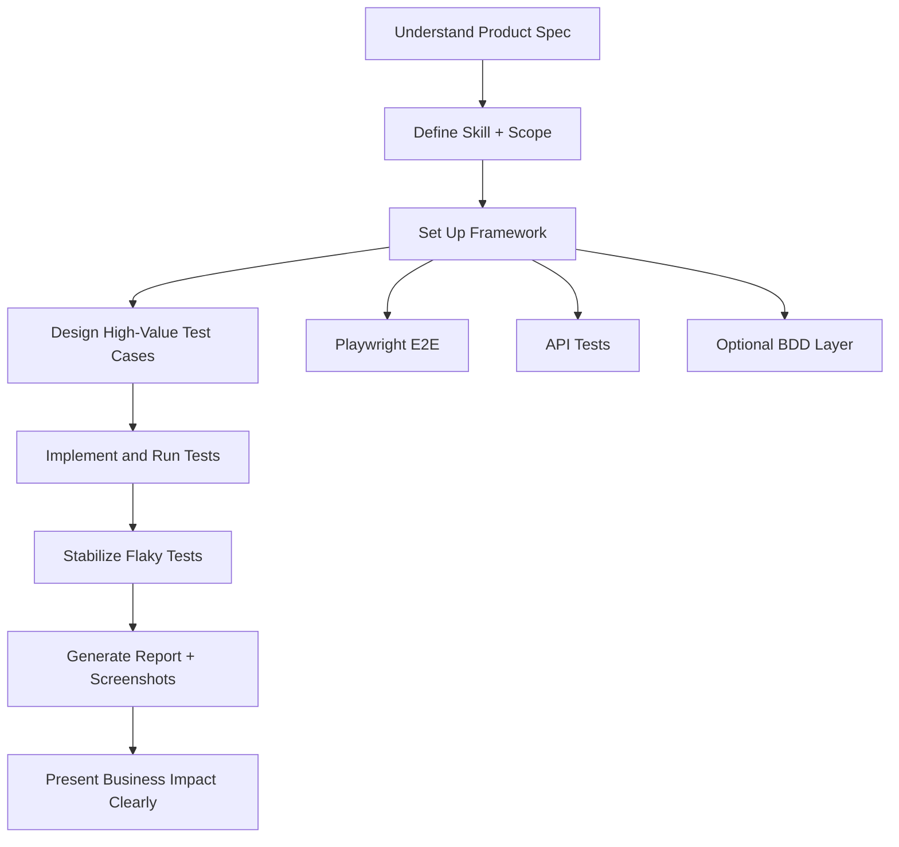

# Simple Guide to Win Your Testing Competition

## 1) What Winning Looks Like
You win when you can clearly show:

1. Strong understanding of the product.
2. Smart automation framework choices.
3. Meaningful test case coverage (not random test scripts).
4. Clean evidence: reports, screenshots, and clear explanation.

If judges understand your work in 2 to 3 minutes, you are ahead.

## 2) Your Skill Definition (Simple Template)
Use this style to define your testing skill clearly.

```md
# Skill: Employee App Test Automation

## Purpose
Create stable, readable, and business-focused tests for the Employee Manager app.

## Scope
- Login and logout flows
- Employee CRUD (add, view, edit, delete)
- Navigation and route protection
- Basic negative scenarios

## Inputs
- Base URL
- Test user credentials
- Seed test data

## Outputs
- Passing test suite
- HTML report
- Screenshots for key flows and failures

## Success Criteria
- Core user journey tests pass
- Flaky tests are minimized
- Failures have clear root-cause logs
```

## 3) Framework That Helps You Win
Keep it simple and consistent.

1. UI Automation: Playwright.
2. API Validation: Jest with backend API tests.
3. Behavior Cases: Cucumber for readable BDD scenarios (optional, but great for interviews).
4. Reporting: Playwright HTML report plus screenshots.

Why this works:

1. Fast execution.
2. Easy debugging.
3. Easy to explain to non-technical judges.

## 4) Case Coverage Strategy
Do not try to automate everything. Cover what matters most.

| Coverage Area | Must-Have Cases | Why It Matters |
|---|---|---|
| Authentication | Valid login, invalid login, logout | Entry gate for all users |
| Employee CRUD | Add, view, edit, delete employee | Core business functionality |
| Validation | Empty fields, invalid email | Data quality and reliability |
| Access Control | Redirect to login when not authenticated | Security and route safety |
| Search/List | Search by name/email/position | Real-world usability |
| Error Handling | API failure messaging | Product resilience |

## 5) Interview-Ready Test Cases (Context-Aware)
Use these examples in interviews.

1. Login with valid credentials should redirect to employee list and set login state.
2. Login with wrong password should show a friendly error and stay on login page.
3. Add employee with valid data should create a new record visible in table.
4. Add employee with invalid email should block save and show validation message.
5. Edit employee position should update row and persist after page refresh.
6. Delete employee should require confirmation and remove record from list.
7. Search for a known employee should filter list in real time.
8. Unauthenticated visit to protected route should redirect to login.
9. Backend error on employee fetch should show a clear error state.
10. Logout should clear session and block access to protected pages.

## 6) Winning Workflow (Flow Diagram)


## 7) Why Skill Matters in Competition
Skill definition is not just documentation. It helps you:

1. Stay focused on scope.
2. Avoid random, low-value tests.
3. Explain your approach with confidence.
4. Show leadership and structured thinking.

Judges usually reward clarity, coverage quality, and reproducibility.

## 8) Submission Checklist
Before posting your final result in the thread:

1. Share repo or folder link with your tests.
2. Add Playwright report screenshot.
3. Add one screenshot of a passed core flow (for example, Add Employee).
4. Add one screenshot of a handled failure case (for example, invalid login).
5. Add a short summary: what you tested, what passed, what you learned.

## 9) 30-Second Pitch for Judges
"I built a focused automation strategy for the Employee Manager app. I covered the highest business-risk flows: authentication, employee CRUD, validation, and access control. I used Playwright and API checks, generated clean reports, and documented failures with screenshots. My goal was not just test execution, but reliable, explainable quality assurance."
